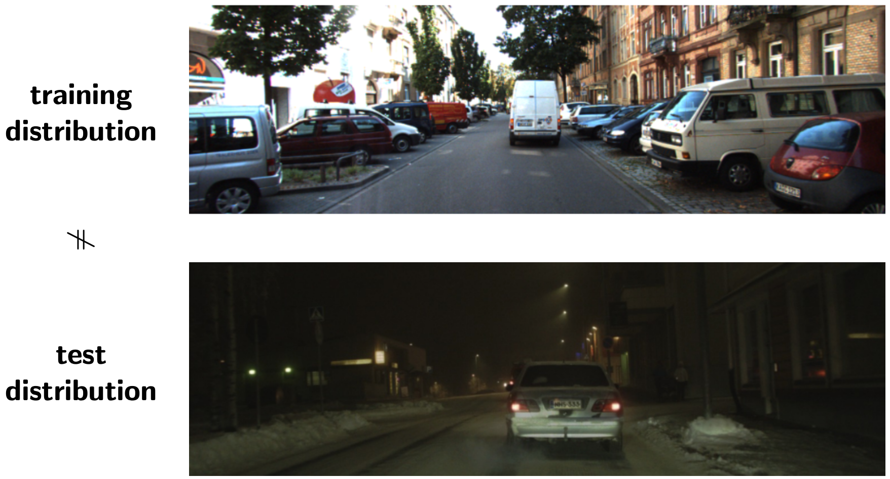
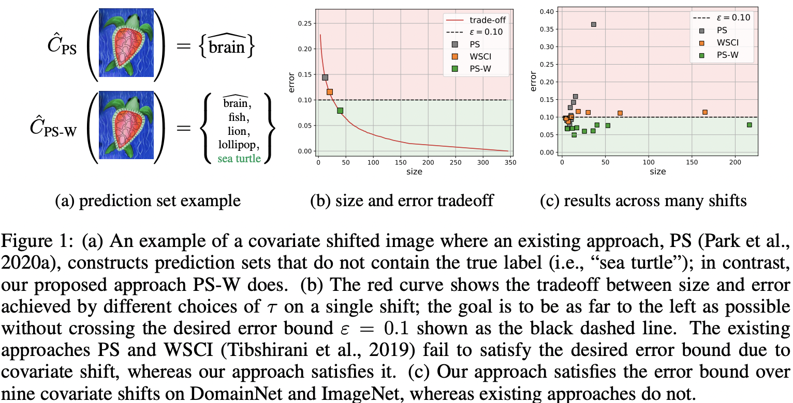

# PAC Prediction Sets Under Covariate Shift

This repository is the PyTorch implementation of 
[PAC Prediction Sets Under Covariate Shift](https://openreview.net/pdf?id=DhP9L8vIyLc) (ICLR22). 
A prediction set is a set-valued function that returns a subset of labels, where the set size represents the uncertainty of the prediction. 
A PAC prediction set is a prediction set that satisfies the probably approximately correct (PAC) guarantee, introduced by Wilks (1941) and Valiant (1984). 

The PAC prediction set is a promising way to measure the uncertainty of predictions, while making correctness guarantee; but 
it relies on the i.i.d. assumption, i.e., labeled examples are independent and identically distributed, which is easily broken in practice due to covariate shift, as shown in the follwoing:


We propose a PAC prediction set algorithm that satisfies the PAC guarantee under covariate shift, while minimizing the expected set size; 
the following teaser summarizes our results.


## DomainNet for Rate Shift

DomainNet consists of six domains (e.g., ketch, clipart, painting, quickdraw, real, and infograph), each of which consists of images from 345 classes. 
We consider the all domains as the source and each domain, including all domains, as a target. 
Thus, we will have 7 adapted models as score functions of PAC prediction sets. 


### Dataset
First of all, we need to donwload and postprocess the [DomainNet](http://ai.bu.edu/M3SDA/) dataset; 
the following script downloads the entire DomainNet datasets and holds out a validation set from a test set for you.
```
./scripts/init_domainnet_dataset.sh
```

### Learning
For each shift, we train a domain adapted classifier via [DANN](https://arxiv.org/pdf/1505.07818.pdf). 
The trained models are provided in this repository and initialized via the following script. 
```
./scripts/init_models.sh
```

### PAC Prediction Set Construction

To construct the `PS-W` prediction set on the shift from all domains to `clipart` with `\epsilon=0.1`, `\delta_C=0.5^{-5}`, `\delta_w=0.5^{-5}`, and `m=50,000`, 
run the following command. 
```
CUDA_VISIBLE_DEVICES=0 python3 main_cls_domainnet.py \
          --exp_name my_demo \
          --data.src DomainNetAll \
          --data.tar DomainNetClipart \
          --train_predset.method pac_predset_worst_rejection \
          --data.seed None \
          --model_predset.eps 0.1 \
          --model_predset.delta 0.5e-5 \
          --model_iwcal.delta 0.5e-5 \
          --data.n_val_src 50000 \
          --model.path_pretrained snapshots_models/DomainNet/domainnet_src_DomainNetAll_tar_DomainNetClipart_dann/model_params_final_no_adv \
          --model_sd.path_pretrained snapshots_models/DomainNet/domainnet_src_DomainNetAll_tar_DomainNetClipart_dann/model_params_srcdisc_best
```

To run `PS-W` with 100 random trials (along with other baselines), run the following script.
```
./scripts/run_main_cls_domainnet_da_all2clipart.sh
```

The core of `PS-W` consists of the following three steps:
```
# Step 1: estimate IWs                                                                                                                                     
args, mdl_iw = uncertainty.est_iw_bin_interval(args, mdl, ds_src, ds_tar)

# Step 2: construct a prediction set via rejection sampling with the worst IWs
mdl_predset = model.PredSetCls(mdl, args.model_predset.eps, args.model_predset.delta, args.model_predset.m)
l = uncertainty.PredSetConstructor_worst_rejection(mdl_predset, args.train_predset, model_iw=mdl_iw)
l.train(ds_src.val)

# Step 3: evaluate the constructed prediction set
l.test(ds_tar.test, ld_name=args.data.tar, verbose=True)
```


## Citation

```
@inproceedings{
    park2022pac,
    title={{PAC} Prediction Sets Under Covariate Shift},
    author={Sangdon Park and Edgar Dobriban and Insup Lee and Osbert Bastani},
    booktitle={International Conference on Learning Representations},
    year={2022},
    url={https://openreview.net/forum?id=DhP9L8vIyLc}
}
```
